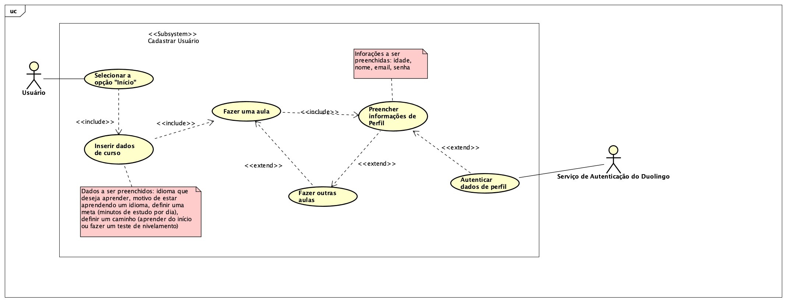
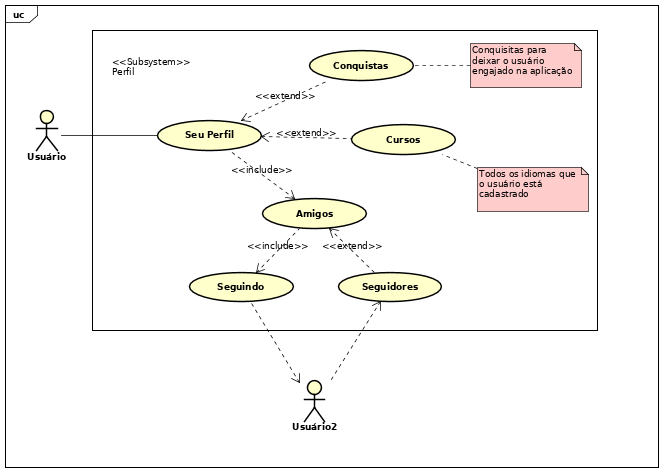

## Introdução
Casos de Uso são utilizados para descrever um conjunto de ações(casos de uso) que um sistema ou um conjunto de sistemas(sujeito) deve desempenhar em colaboração com um ou mais usuários externos ao sistema(ator). Cada caso de uso deverá prover algum resultado observável e de valor para os atores ou outros interessados do sistema.

## Metodologia
Para criação dos casos de uso foram identificados e analisados os documentos de elicitação de requisitos gerados na sprint anterior. A partir disso, foram feitos os casos de uso utilizando a ferramenta Astah.

## Casos de Uso & Especificação

### **UC01 - Fazer Login**

| UC01                     | Fazer Login |
| --------------           |:----------- |
| **Versão**               | Atual: 1.0 (25/09)   Anterior: -- |
| **Autor(es)**            | Luis Gustavo e Vitor Alves |
| **Descrição**            | Fazer Login no Duolingo |
| **Ator(es)**             | > Usuário   > Duolingo |
| **Pré condições**        | > Usuário estar deslogado no aplicativo |
| **Fluxo principal**      | > Usuário acessa o Duolingo   > Usuário clica no botão "Já tenho uma conta"   > Usuário insere os dados de email ou nome de usuário e senha   > Usuário clica no botão "Entrar"   > Os dados de login são autenticados |
| **Fluxos alternativos**  | **Fluxo Alternativo 1 - Cadastro:**   > Usuário acessa o Duolingo   > Usuário clica no botão "Início"   > Usuário segue os passos para realizar o [cadastro](#uc02-cadastrar-usuario)   > O usuário é logado automaticamente ao criar seu cadastro |
| **Fluxos de exceção**    |  **Fluxo de Exceção 1 - Dados de Login inválidos:**   > Aplicativo apresentar uma mensagem de erro avisando que não foi possível fazer o Login     **Fluxo de Excecão 2 - Usuário esqueceu a senha:**   > Usuário clica no botão "Esqueci a Senha"   > Usuário insere email para recuperar a senha   > É feita uma validação para identificar se existe um usuário cadastrado com aquele email   > É enviado um email para o usuário redefinir sua senha |
| **Pós condições**        | Usuário fica logado no Duolingo e é direcionado para a aba de aulas |
| **Rastreabilidade**      | INT02 |

### **UC02 - Cadastrar Usuário**

| UC02                     | Cadastrar usuário |
| --------------           |:----------- |
| **Versão**               | Atual: 1.0 (26/09)   Anterior: -- |
| **Autor(es)**            | Luis Gustavo e Vitor Alves |
| **Descrição**            | Criar cadastro para um usuário |
| **Ator(es)**             | > Usuário   > Duolingo |
| **Pré condições**        | > Usuário estar deslogado no aplicativo |
| **Fluxo principal**      | > Usuário acessa o Duolingo   > Usuário clica no botão "Início"   > Usuário insere do curso(idioma que deseja apreder, motivo de estar aprendendo um idioma, meta(minutos de estudo por dia) e caminho(aprender do início ou fazer um teste de nivelamento))   > Usuário segue os passos para realizar uma [aula](#uc05-aulas)   > Usuário insere as informações de perfil(idade, nome, email e senha)   > Os dados de cadastro são autenticados |
| **Fluxos alternativos**  | **Fluxo Alternativo 1 - Usuário realiza mais aulas:**   > Usuário acessa o Duolingo   > Usuário clica no botão "Início"   > > Usuário insere do curso(idioma que deseja apreder, motivo de estar aprendendo um idioma, meta(minutos de estudo por dia) e caminho(aprender do início ou fazer um teste de nivelamento))   > Usuário segue os passos para realizar uma [aula](#uc05-aulas)   > Usuário clica no botão "Depois"   > > Usuário segue os passos para realizar uma [aula](#uc05-aulas)   > Usuário clica no botão "Criar Perfil"   > Usuário segue os passos para realizar uma [aula](#uc05-aulas)   > Usuário insere as informações de perfil(idade, nome, email e senha)   > Os dados de cadastro são autenticados |
| **Fluxos de exceção**    |  **Fluxo de Exceção 1 - Email já cadastrado:**   > Aplicativo mostra que já existe um usuário cadastrado com esse email e fornece o campo de senha para fazer login nessa conta já cadastrada     **Fluxo de Excecão 2 - Email inválido:**   > Aplicativo apresenta uma mensagem de erro pedindo para o usuário inserir um email válido     **Fluxo de Excecão 3 - Idade inválida, negativa ou muito alta:**   > Aplicativo apresenta uma mensagem de erro pedindo para o usuário inserir uma idade válida |
| **Pós condições**        | Usuário fica logado no Duolingo e é direcionado para a aba de aulas |
| **Rastreabilidade**      | INT02 |

### **UC03 - Adicionar Amigos**

| UC03                     | Adicionar Amigos |
| --------------           |:----------- |
| **Versão**               | Atual: 1.0 (28/09)   Anterior: -- |
| **Autor(es)**            | Francisco Heronildo e Vitor Meireles |
| **Descrição**            | Adicionar amigos ao seu perfil no Duolingo |
| **Ator(es)**             | > Usuário   > Duolingo |
| **Pré condições**        | > Usuário estar [cadastrado](#uc02-cadastrar-usuario) no aplicativo |
| **Fluxo principal**      |> Usuário acessa o Duolingo   > Usuário clica no ícone do seu "Perfil"   > Usuário clica em "Amigos"   > Usuário clica em "Adicionar"   > Usuário clica em "Localizar um amigo"   > Usuário insere nome ou email do amigo no qual quer adicionar |
| **Fluxos alternativos**  | **Fluxo Alternativo 1 - Adicionar Amigos:** > Usuário acessa o Duolingo   > Usuário clica no ícone do seu "Perfil"   > Usuário clica em "Amigos"   > Usuário clica em "Adicionar"   > Usuário clica em "Convidar um amigo"   > Usuário insere o email do amigo     **Fluxo Alternativo 2 - Adicionar Amigos pelo site:** > Usuário acessa o Duolingo   > Usuário clica em "Enviar Convite"   > Usuário insere o email do amigo    **Fluxo Alternativo 3 - Adicionar Amigos pelo Facebook:** > Usuário acessa o Duolingo   > Usuário clica em "Encontre Amigos no Facebook"   > Autorize o Facebook   |
| **Fluxos de exceção**    | **Fluxo de Exceção 1 - Nome ou email inválido:**   > Aplicativo apresentar uma mensagem de erro avisando que não foi possível encontrar o usuário desejado  |
| **Pós condições**        | Usuário fica logado no Duolingo e consegue acompanhar os XP's que o amigo adquire |
| **Rastreabilidade**      | AD04 |

### **UC04 - Escolher Cursos**

| UC04                     | Cursos |
| --------------           |:----------- |
| **Versão**               | Atual: 1.0 (29/09)   Anterior: -- |
| **Autor(es)**            | Francisco Heronildo e Vitor Meireles |
| **Descrição**            | Usuário escolher o idioma que quer aprender |
| **Ator(es)**             | > Usuário   > Duolingo |
| **Pré condições**        | > Usuário estar deslogado no aplicativo |
| **Fluxo principal**      | > Usuário acessa o Duolingo   > Usuário clica no botão "Começar Agora"   > Usuário insere do curso(idioma que deseja aprender, motivo de estar aprendendo um idioma, meta(minutos de estudo por dia) e caminho(aprender do início ou fazer um teste de nivelamento))   > Usuário segue os passos para realizar uma [aula](#uc05-aulas)   |
| **Fluxos alternativos**  | **Fluxo Alternativo 1 - Escolher mais cursos:** > Usuário acessa o Duolingo   > Usuário clica no ícone da bandeira de seu curso   > Usuário clica em "Curso" ou "Adicionar um novo curso"   > Usuário adiciona outro curso   > Usuário começa o novo curso   |
| **Fluxos de exceção**    | --- |
| **Pós condições**        | Usuário é direcionado para a aba de aulas |
| **Rastreabilidade**      | Q01 |

### **UC05 - Aulas**

| UC05                     | Aulas |
| --------------           |:----------- |
| **Versão**               | Atual: 1.0 (29/09)   Anterior: -- |
| **Autor(es)**            | Francisco Heronildo e Vitor Meireles |
| **Descrição**            | Usuário deve escolher qual aula quer fazer |
| **Ator(es)**             | > Usuário   > Duolingo |
| **Pré condições**        | > Usuário estar [cadastrado](#uc02-cadastrar-usuario) no aplicativo |
| **Fluxo principal**      | > Usuário acessa o Duolingo   > Usuário clica na aula que quer escolher   > Usuário clica em iniciar >   Uma aula terá início   |
| **Fluxos alternativos**  | --- |
| **Fluxos de exceção**    | --- |
| **Pós condições**        |  Usuário pode abandonar a aula e retomar depois|
| **Rastreabilidade**      | Q01 |

## Referências

SEQ18RRANO, Maurício; SERRANO, Milene. Requisitos - Aula 11. 1º/2019. 40 slides. Material apresentado para a disciplina de Requisitos de Software no curso de Engenharia de Software da UnB, FGA.