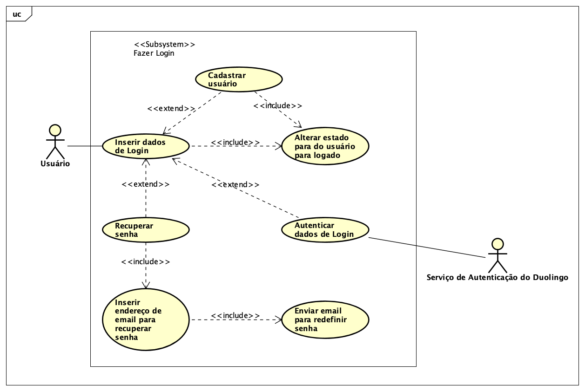

## Introdução

## Metodologia

## Casos de Uso & Especificação

### **UC01 - Fazer Login**

| UC01                     | Fazer Login |
| --------------           |:----------- |
| **Versão**               | Atual 1.0 (26/09)   Anterior: -- |
| **Autor(es)**            | Luis Gustavo e Vitor Alves |
| **Descrição**            | Fazer Login no Duolingo |
| **Ator(es)**             | > Usuário   > Duolingo |
| **Pré condições**        | > Usuário estar deslogado no aplicativo |
| **Fluxo principal**      | > Usuário acessa o Duolingo   > Usuário clica no botão "Já tenho uma conta"   > Usuário insere os dados de email ou nome de usuário e senha   > Usuário clica no botão "Entrar"   > Os dados de login são autenticados |
| **Fluxos alternativos**  | **Fluxo Alternativo 1 - Cadastro:**   > Usuário acessa o Duolingo   > Usuário clica no botão "Início"   > Usuário segue os passos para realizar o [cadastro]()   > O usuário é logado automaticamente ao criar seu cadastro |
| **Fluxos de exceção**    |  **Fluxo de Exceção 1 - Dados de Login inválidos:**   > Aplicativo apresentar uma mensagem de erro avisando que não foi possível fazer o Login     **Fluxo de Excecão 2 - Usuário esqueceu a senha:**   > Usuário clica no botão "Esqueci a Senha"   > Usuário insere email para recuperar a senha   > É feita uma validação para identificar se existe um usuário cadastrado com aquele email   > É enviado um email para o usuário redefinir sua senha |
| **Pós condições**        | Usuário fica logado no Duolingo e é direcionado para a aba de aulas |
| **Rastreabilidade**      | -- |

## Referências

SEQ18RRANO, Maurício; SERRANO, Milene. Requisitos - Aula 11. 1º/2019. 40 slides. Material apresentado para a disciplina de Requisitos de Software no curso de Engenharia de Software da UnB, FGA.